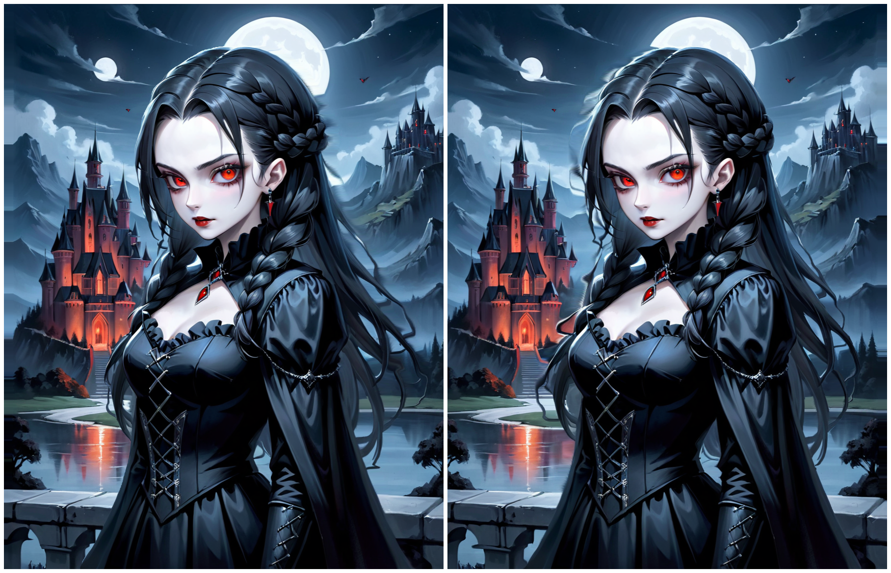
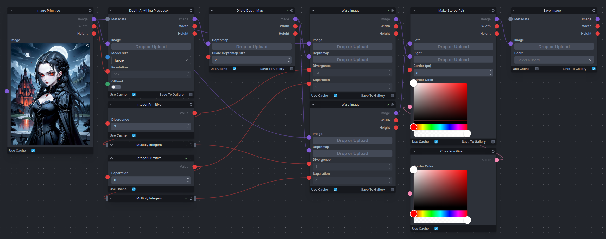

# Stereogram Custom Nodes for InvokeAI

This repository contains custom nodes for InvokeAI to create cross-view or
parallel-view stereograms. Stereograms are 2D images that, when viewed properly,
reveal a 3D scene.

Example stereo image (with embedded workflow):

## Cross-view vs. parallel-view

* Cross-view stereograms are viewed by crossing your eyes such that the left
  image pane becomes the right-eye image, and the right image pane becomes the
  left eye image.
* Parallel-view stereograms are viewed by diverging your eyes such that left
  and right images are viewed by the left and right eye, respectively. Note, for
  larger disparities (e.g., on a computer screen), cross-view images are
  easier to view.

## Custom nodes

The file `stereogram.py` contains three nodes for InvokeAI's workflow system. An
example cross-view workflow for the nodes is here. To turn this into a
parallel-view image, simply swap the left/right images on the "Make Stereo
Pair" node.

In particular, these nodes are provided:

* **Dilate Depth Map**: This node takes an input depth map and performs a
  dialtion operation on the depth map. This causes close depth values (white)
  to expand spacially. This is useful for depth maps auto-generated by AI models
  (such as DepthAnything), which are usually quite tight around the foreground
  objects, leading to foreground colors bleeding into the background.

* **Warp Image**: Takes an input depth map and color image, and warps the color
  image according to geometric information from the depth map. The node can be
  configured using a `divergence` value (in percent) and a `separation` value
  (in percept).
  Larger divergence causes a stronger 3D effect (and more artifacts). Separation
  simply shifts the image.
  A positive divergence generates right-eye images, a negative divergence
  generates left-eye images. For cross-view, the images have to be swapped. A
  positive separation value causes the image to get shifted left, a negative
  separation value causes the image to get shifted right.

* **Make Stereo Pair**: Horizontally stacks a left and right input image into
  a stereogram. Optionally, a border is drawn around the left and right image
  with a configurable color.
